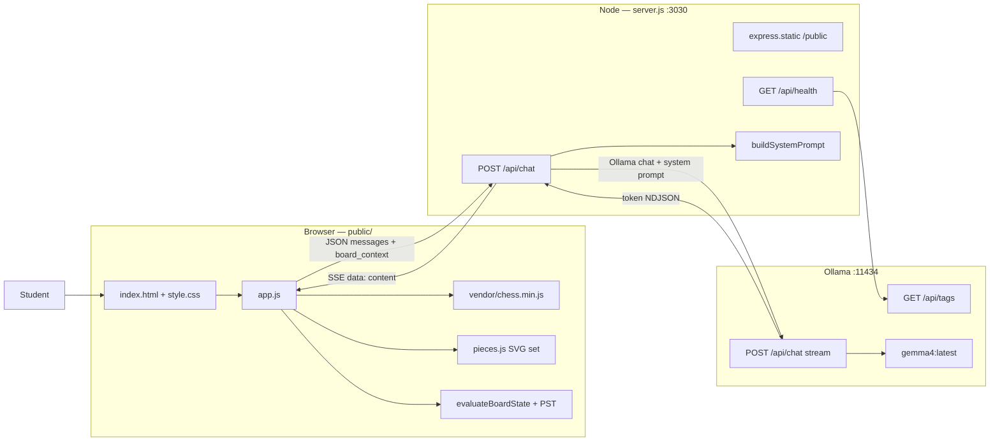
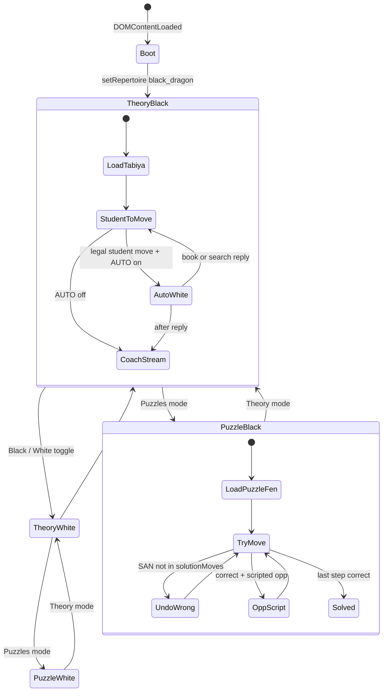
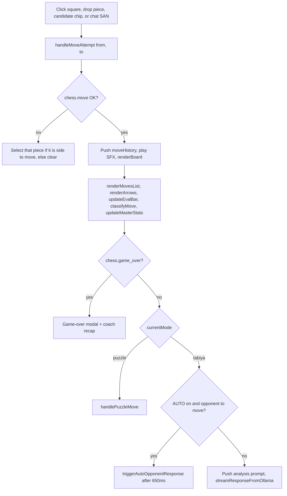
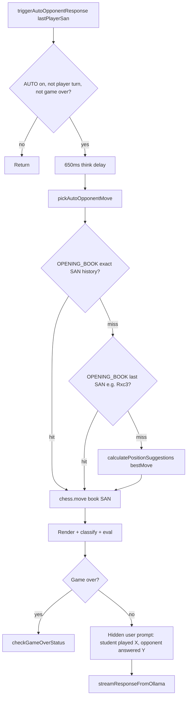
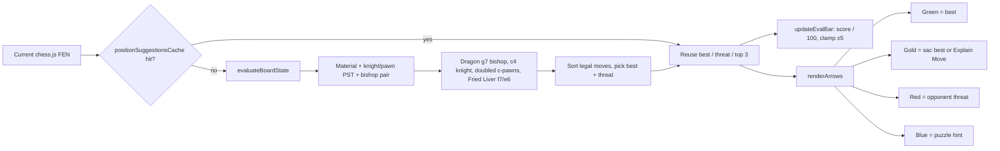
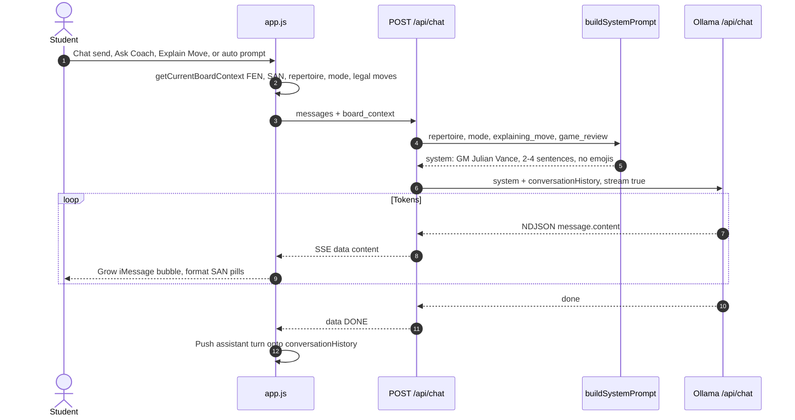
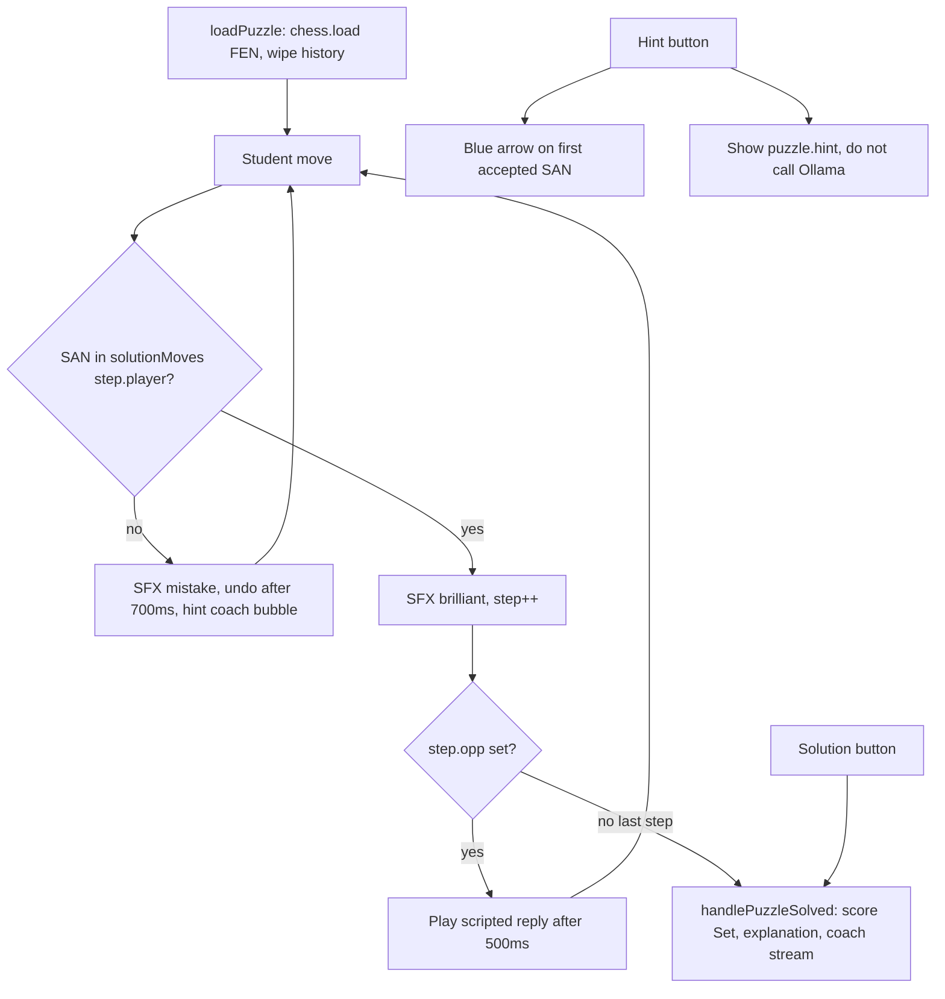
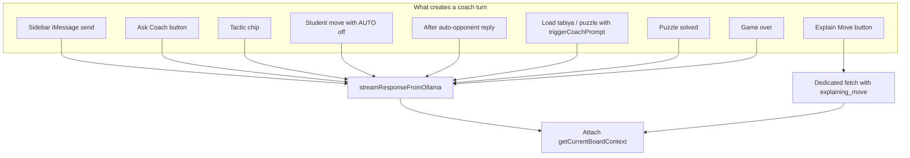

# Sicilian Dragon Chess Coach

Interactive grandmaster analysis board with an iMessage-style coach sidebar. **GM Julian Vance** streams coaching from a local [Ollama](https://ollama.com) model (`gemma4`) while you play, study, and review opening lines.

The board is a Greco-Roman / Chess.com-style arena (Carrara ivory and Verona green marble, gold-leaf bevels). The sidebar is a live conversation that always sees the current FEN, move list, repertoire, and legal candidates.


**Repo:** [github.com/murderszn/chess-coach](https://github.com/murderszn/chess-coach) · **Architecture (GitHub Pages):** [murderszn.github.io/chess-coach](https://murderszn.github.io/chess-coach/)

---

## What it does

- **Play and study** two repertoires from tabiya (known starting positions) or from move 1.
- **Spar against a built-in opponent** that follows opening book, then a fast in-browser search.
- **Talk to the coach** in the sidebar; every request includes live board context so answers stay on the actual position.
- **Drill tactics** in puzzle / master-test mode with hints, solutions, and a per-repertoire score.
- **Review the live game** with an eval ribbon and a game-over recap from the coach. Review/PGN *modals* are in the HTML but not hooked up yet.

---

## Features

### Dual repertoires

| Side | Theme | Lines |
| --- | --- | --- |
| **Black** (dark theme) | Sicilian Dragon | Yugoslav 9.Bc4 / 12.h4, thematic `...Rxc3`, Soltis `12...h5`, `9.0-0-0 d5!`, Chinese Dragon `10...Rb8`, Levenfish `6.f4`, Classical `6.Be2`, plus start-from-1.e4 |
| **White** (light theme) | Aggressive 1.e4 | Fried Liver `6.Nxf7`, Two Knights `4.Ng5`, Evans Gambit `4.b4`, Grand Prix `3.f4`, Smith-Morra `3.c3`, King's Gambit, plus start-from-1.e4 |

Switch with the **Black / White** segmented control. Theory vs puzzles is a second toggle.

### Board

- Legal-move dots, capture rings, last-move highlights, drag-and-drop and click-to-move
- Live eval bar and SVG arrows (best move, threats, candidates)
- Move classification badge (book / great / brilliant, etc.)
- Captured-material strips and material advantage
- Eval & accuracy ribbon under the board
- Navigation: `|<` `<` `>` `>|`, flip, reset, copy FEN
- Optional Lichess-style master-database stats banner for the current line
- Web Audio move / capture / check / game-over sounds

### Coach (GM Julian Vance)

- Streaming tokens from Ollama via `/api/chat` (SSE)
- System prompt is rebuilt from the live board: FEN, SAN history, last move, turn, check, legal moves, repertoire, and mode
- Quick-tactic chips (e.g. `12...Nc4`, `...Rxc3`, `6.Nxf7`)
- **Ask Coach** sends the current position
- **Explain Move** asks for a 3-sentence breakdown of the selected move
- Clickable SAN in chat can be played onto the board
- Coach replies are constrained to 2–4 sentences, no emojis, exact notation

### Puzzles

Per repertoire: Dragon exchange sac, `...d5` strike, Chinese `...b4`, Soltis `Nxh5`, discovered `Nxe4`; Fried Liver `Nxf7` / `Qf3+`, Evans `b4` / `d4`, Grand Prix `f5`.

Hint, reveal solution, prev/next, and a running score.

### Game over

- Checkmate / draw modal with rematch
- Coach streams a short post-game recap
- **REVIEW** and **PGN** controls are present in the UI (`index.html`) and cached as DOM refs, but `app.js` does not open those modals or parse PGN yet

### Auto-opponent

When **AUTO** is on, the computer answers on the opposite color:

1. Exact opening-book reply for the Dragon / Italian / Evans lines
2. Tactical book replies (`Rxc3` → `bxc3`, `Nxf7` → `Kxf7`, …)
3. Fallback: memoized 1-ply + tactical-check search with Dragon / Fried Liver heuristics

---

## Prerequisites

- **Node.js** 18 or newer (`fetch` is used on the server)
- **[Ollama](https://ollama.com)** running locally
- Model **`gemma4`** (or any chat model you pass; the default is `gemma4:latest`)

```bash
ollama pull gemma4
ollama serve   # if it is not already running
```

Confirm the model is listed:

```bash
ollama list
```

---

## Run locally

```bash
git clone https://github.com/murderszn/chess-coach.git
cd chess-coach
npm install
npm start
```

Open [http://localhost:3030](http://localhost:3030).

### Environment

| Variable | Default | Meaning |
| --- | --- | --- |
| `PORT` | `3030` | HTTP port for the Express app |
| `OLLAMA_HOST` | `http://127.0.0.1:11434` | Ollama base URL |

Example:

```bash
PORT=8080 OLLAMA_HOST=http://127.0.0.1:11434 npm start
```

---

## How to use

1. Pick **Black** (Dragon) or **White** (1.e4 attack).
2. Stay on **Theory** and choose a tabiya from the dropdown, or start from move 1.
3. Play on the board. With **AUTO** on, the opponent replies and the coach comments.
4. Use the sidebar or **Ask Coach** / **Explain Move** for analysis.
5. Switch to **Puzzles** for master tests; use Hint / Solution as needed.
6. Toggle arrows, master stats, sound, and auto-play from the tool island.

---

## How it works

Interactive diagrams: **[murderszn.github.io/chess-coach](https://murderszn.github.io/chess-coach/)** (this repo’s GitHub Pages site, served from `docs/`).

Two engines sit next to each other. The board is legal chess plus a search stack (Lichess masters, Stockfish 18 WASM, then a local fallback). **Ollama Gemma 4** owns the words. Express proxies chat and queues engine jobs; it does not pick moves itself.

Game-review and PGN buttons exist in `index.html` and are queried in `app.js`, but they are not wired to handlers yet. Everything below is the live path.

### 1. Runtime map



| Path | Role |
| --- | --- |
| `server.js` | Static files, `/api/health`, `/api/chat` proxy + coach system prompt |
| `public/index.html` | Golden-ratio split: board (~62%) and iMessage sidebar (~38%) |
| `public/style.css` | Greco-Roman design system, board, modals |
| `public/app.js` | Game tree, puzzles, eval, arrows, chat streaming |
| `public/pieces.js` | Vector SVG pieces |
| `public/vendor/chess.min.js` | chess.js for validation and FEN/PGN |
| `public/assets/` | Colonnade background and coach avatar |
| `test_coach_suite.js` | Live coach role-play checks against `/api/chat` |

The npm `stockfish` package is listed for a future engine hookup. The live eval bar is **not** Stockfish.

### 2. Client state



`currentRepertoire` is `black_dragon` or `white_attack`. `currentMode` is `tabiya` or `puzzle`. `moveHistory[]` is the game tree (`san`, `fen`, `from`, `to`). `currentMoveIndex` is the ply you are looking at. `conversationHistory[]` is what gets sent to Ollama.

### 3. A move on the board



Click-to-move: first click selects a piece of the side to move and shows legal dots; second click tries the move. Drag-and-drop uses the same `handleMoveAttempt`. Chat SAN that matches a legal move also calls it.

### 4. Auto-opponent



Book is hardcoded Dragon / Italian / Evans sequences. Search is one ply of every legal move, plus a short tactical look at the opponent’s captures and checks, with bonuses for `Nxf7`, `Rxc3`, `Qf3+`, `...Nc4`, `...d5`. Results are memoized by FEN.

### 5. Eval bar and arrows



### 6. Coach stream



`buildSystemPrompt` also swaps theory text: Dragon (`...Rxc3`, g7 bishop, c4, `...d5`) vs White 1.e4 (f7, Fried Liver, Evans, Morra, Grand Prix). Puzzle mode asks for hints that do not spoil the move. Explain-Move mode asks for a 3-sentence tactical / structural / alternative note.

### 7. Puzzle engine



### 8. Prompt sources

Anything that talks to Gemma goes through `streamResponseFromOllama` except **Explain Move**, which posts the same `/api/chat` shape itself and sets `explaining_move`.



---

## HTTP API

### `GET /api/health`

Probes Ollama `/api/tags`.

Success:

```json
{
  "status": "ok",
  "ollama_connected": true,
  "models": ["gemma4:latest"],
  "current_model": "gemma4:latest"
}
```

`502` if Ollama is unreachable.

### `POST /api/chat`

Streams SSE (`text/event-stream`). Each event is `data: {"content":"..."}`; the stream ends with `data: [DONE]`.

```json
{
  "model": "gemma4:latest",
  "messages": [
    { "role": "user", "content": "White played 12.h4. What is our plan?" }
  ],
  "board_context": {
    "repertoire": "black_dragon",
    "mode": "tabiya",
    "preset": "Yugoslav 9.Bc4 Main Line (12.h4)",
    "fen": "2rq1rk1/pp1bppbp/3p1np1/4n3/2BNP2P/2N1BP2/PPPQ2P1/2KR3R b - - 0 12",
    "san_history": "1.e4 c5 2.Nf3 d6 ... 12.h4",
    "last_move": "h4",
    "turn": "Black",
    "is_check": false,
    "is_game_over": false,
    "legal_moves": ["Nc4", "h5", "Re8"]
  }
}
```

`board_context` fields the server understands: `repertoire` (`black_dragon` \| `white_attack`), `mode` (`tabiya` \| `puzzle`), `preset`, `fen`, `san_history`, `last_move`, `explaining_move`, `turn`, `is_check`, `is_game_over`, `is_checkmate`, `legal_moves`, `game_review`.

---

## Tests

With the server and Ollama running:

```bash
node test_coach_suite.js
```

The suite posts three coaching prompts (Dragon 12.h4 plan, Fried Liver `6.Nxf7`, critique of passive `10...a6`) and checks that replies stay concise, skip emojis, and mention the book ideas.

---

## Scripts

| Command | Description |
| --- | --- |
| `npm start` / `npm run dev` | Start Express on `PORT` (default 3030) |

---

## Troubleshooting

| Symptom | What to check |
| --- | --- |
| Coach bubble: connection error | `ollama serve` is running; `OLLAMA_HOST` matches it |
| Health `ollama_error` | Ollama not on 11434, or firewall blocking localhost |
| Empty / wrong model | `ollama pull gemma4`; `GET /api/health` lists models |
| Opponent never moves | Turn **AUTO** on; you must be on the repertoire’s color to move |
| Eval bar looks “Stockfish-like” but shallow | Expected — it is the local heuristic engine, not Stockfish |

## Contributing

Contributions are what make the open source community such an amazing place to learn, inspire, and create. Any contributions you make are **greatly appreciated**.

Please read the [Contributing Guidelines](CONTRIBUTING.md) for details on our code of conduct, and the process for submitting pull requests to us.

## Code of Conduct

We are committed to fostering a welcoming and inspiring community for all. Please read our [Code of Conduct](CODE_OF_CONDUCT.md) to understand the expectations for behavior in this project.

## License

Distributed under the MIT License. See [LICENSE](LICENSE) for more information.
